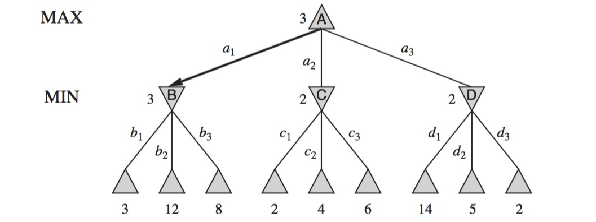
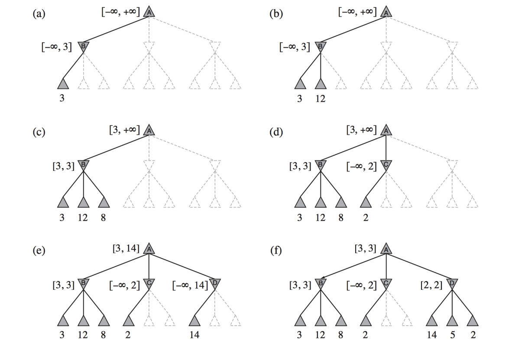
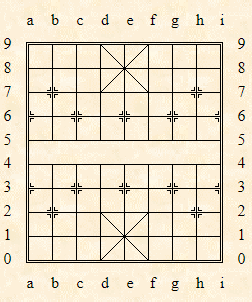
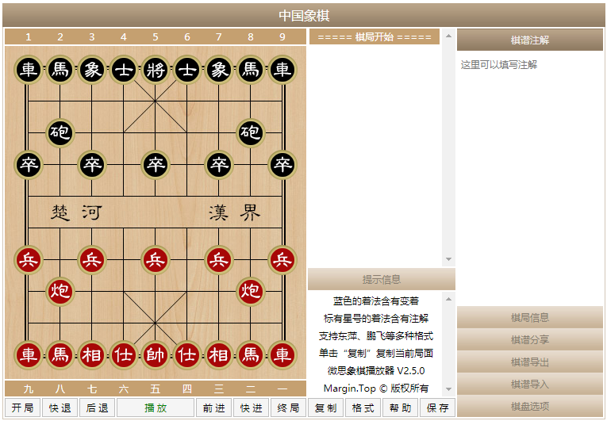
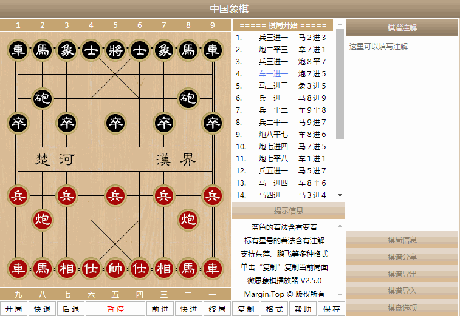

# Alpha-Beta Pruning

Alpha-beta剪枝算法是极小极大搜索算法的优化，主要解决博弈问题和对策问题。这类算法被广泛运用于棋类等零和对策问题，比如井字棋(Tic-Tac-Toe)、国际象棋、中国象棋等。

本文通过alpha-beta剪枝算法实现中国象棋人机对战，了解和掌握该算法。

## 技术栈准备

[[GitHub地址](https://github.com/MegaShow/AlphaBetaPruning)]

前端UI使用[vschess](https://github.com/FastLight126/vschess)实现，这是一个中国象棋Web UI框架，提供丰富的API接口，能很简单地分离UI和实际算法逻辑。不过缺点是该库刚刚被重构，在使用的时候遇到了悔棋后棋盘布局数据错误的BUG。

算法逻辑使用Golang实现，具体实现完全与UI分离开。前端与算法逻辑中间有一个中间层，分别用了路由API、Web Assembly实现了两个中间层。

路由API的本质是前后端分离，优点是Golang本地执行性能高，缺点是发布需要额外执行一个服务端。

Web Assembly需要Golang 1.11+支持，是Golang的实验性功能，优点是发布仅需要让JavaScript调用`.wasm`文件，无需额外启动服务端，缺点是Golang Web Assembly的性能不如Golang本地二进制执行。

## 极小极大搜索算法

极小极大搜索算法的基本思想是在博弈双方对弈若干步之后，从可能的步数中选择最好的一步走法来走，即在有限的搜索深度范围内找到相对好的解。

其中，电脑为MAX方，人为MIN方，按照该回合是电脑走子还是人走子来分成极大值层和极小值层，并且无论是极大值层还是极小值层，都应该由MAX方考虑该怎么走。

极小极大搜索算法的策略如下：

* 轮到MIN方走子时，MAX方应该考虑最坏的情况。因此该层称为极小值层。
* 轮到MAX方走子时，MAX方应该考虑最好的情况。因此该层称为极大值层。
* 搜索到固定深度后，应该往上一层以极大极小交替的形式传递倒推值。

> 通常，我们使用`正方形`表示极大值层，`圆形`表示极小值层。不过这里图片都是以三角形的方向表示极大值层或极小值层。



可以发现，该图的搜索深度为2。搜索到该深度之后，就开始向上传递极小值，然后上一层再向上上层传递极大值。这样，最终则选择执行B的走法。

一个简单的极大极小值算法实现如下：

```go
func Minimax(chess *Chess, depth int) int {
	if depth == 0 || chess.IsWin('b') || chess.IsWin('w') {
		return chess.Evaluate()
	}
	steps := chess.GetNextSteps()
	if chess.Next == 'b' { // 极大值层
		v := math.MinInt32
		for _, step := range steps {
			move := chess.Move(step)
			v = int(math.Max(float64(v), float64(Minimax(chess, depth-1))))
			chess.UnMove(move)
		}
		return v
	} else { // 极小值层
		v := math.MaxInt32
		for _, step := range steps {
			move := chess.Move(step)
			v = int(math.Min(float64(v), float64(Minimax(chess, depth-1))))
			chess.UnMove(move)
		}
		return v
	}
}
```

## Alpha-beta剪枝算法

极小极大搜索算法虽然能在固定的搜索深度内找到相对好的解，但是随着深度的增加，其搜索时间指数增长。Alpha-beta剪枝算法在极小极大搜索的基础上，对部分不需要考虑的节点或分支进行剪枝操作。

极小极大搜索算法生成了搜索树之后，会对整个搜索树的结点进行遍历。但实际上，在某种情况下，我们计算出某个节点的估计值之后，将其倒推回给它的前驱，它的前驱将得到一个前驱的估计值的不等式，并且可以判断出该前驱的估计值不再需要计算，即最初的节点的剩下的兄弟不再需要计算估计值。

我们定义极大值层的下界为$\alpha$，定义极小值层的上界为$\beta$。

打个比方，目前由MAX方考虑极大值层，在计算某个节点的估计值。它知道它的前驱层节点的$\beta$值，MAX方通过某个子节点的倒推值计算出一个新的$\alpha$值，并且满足$\alpha \ge \beta$。那么意味着它的前驱层存在别的节点，使得棋局情况比考虑它的父节点的情况更坏，因为前驱层为极小值层，所以MIN方不可能选择它的父节点，而是选择更坏的节点。因此该节点剩下的兄弟节点的估计值不再需要计算，可以剪枝。这种剪枝称为$\beta$剪枝。

如果目前由MAX方考虑极小值层，在计算某个节点的估计值。它知道它的前驱层节点的$\alpha$值，MAX方通过某个子节点的倒推值计算出了一个新的$\beta$值，并且满足$\alpha \ge \beta$。那么意味着它的前驱层存在别的节点，使得棋局情况比考虑它的父节点的情况更好，因为前驱层为极大值层，所以MAX方不可能选择它的父节点，而是选择更好的节点。因此该节点剩下的兄弟节点估计值不再需要计算，可以剪枝。这种剪枝称为$\alpha$剪枝。

在经过$\alpha$剪枝之后，MIN节点最终的倒推值就确定为该$\beta$值，$\beta$剪枝也一样。



步骤(a)、(b)计算出B的估计值为3，即B所在极小值层的$\beta$值为3。步骤(c)中B将估计值倒推给A，因此A的估计值为3，即A所在的极大值层的$\alpha$值为3。在计算C的估计值的时候，C知道前驱层的$\alpha$值为3，因此C搜索第一个子节点，计算出$\beta$值为2时，就知道C的其余的子节点无需继续考虑了。这是一个$\alpha$剪枝的例子。

一个简单的alpha-beta剪枝算法实现如下：

```go
func AlphaBetaPruning(chess *Chess, depth, alpha, beta int) int {
	if depth == 0 || chess.IsWin('b') || chess.IsWin('w') {
		return chess.Evaluate()
	}
	steps := chess.GetNextSteps()
	for _, step := range steps {
		move := chess.Move(step)
		v := AlphaBetaPruning(chess, depth-1, alpha, beta)
		chess.UnMove(move)
		if chess.Next == 'b' { // 极大值层
			if alpha < v {
				alpha = v
			}
		} else { // 极小值层
			if beta > v {
				beta = v
			}
		}
		// alpha-beta剪枝
		if beta <= alpha {
			break
		}
	}
	if chess.Next == 'b' {
		return alpha
	} else {
		return beta
	}
}
```

 ## 棋盘数据类型

### 棋盘结构

为了方便程序逻辑实现，我们需要定义一个表示棋盘的结构体。中国象棋可以用一个9*10的二维数组表示，但是为了方便，我们需要额外添加一些除了棋盘棋子之外的信息属性。

```go
type Chess struct {
	Board          map[int]Piece
	Next           byte
	BlackKingIndex int
	RedKingIndex   int
}

type Piece struct {
	Type        int
	Index       int // Index = NumberIndex * 9 + AlphaIndex
	AlphaIndex  int
	NumberIndex int
}
```

`Chess`为棋盘结构体，其中的`Board`是一个关联数组(映射)，存储从索引下标到棋子变量的映射。`Next`表明下一个走子的是红方还是黑方，其中红方由`w`表示，黑方用`b`(之所以是`w`我猜是因为FEN格式是从国际象棋那里学来的)。其中，红方为人，即MIN方，黑方为电脑，即MAX方。`BlackKingIndex`和`RedKingIndex`分别存储将和帅的索引下标。

`Piece`为棋子结构体，`Type`为棋子类型，实际上是ASCII字符。在中国象棋中有红黑双方，每一方又有7类棋子。我们使用ASCII字符中的字母来表示棋子类型，其中红方使用大写字母，黑方使用小写字母。

| 棋子类型 | 红方 | 黑方 |
| :------: | :--: | :--: |
|  帅/将   | `K`  | `k`  |
|  仕/士   | `A`  | `a`  |
|  相/象   | `B`  | `b`  |
|    马    | `N`  | `n`  |
|    车    | `R`  | `r`  |
|    炮    | `C`  | `c`  |
|  兵/卒   | `P`  | `p`  |

`Index`是棋子在棋盘中的索引下标，存在等式$Index = NumberIndex * 9 + AlphaIndex$。在中国象棋的棋盘中，我们将从红到黑的垂直的棋子位置分别表示为0~9，将以红方作为标准从左到右的水平的棋子位置分别表示为a~i。这样，每个棋子都有一个数字下标和一个字母下标。



这样，当我们想要表示一个棋子移动的动作的时候，只需要用四个索引来表示这个行为。比如`g4g5`表示将`g4`位置的棋子移动到`g5`。

### 绑定方法

为了实现中国象棋人机对战，我们需要对`Chess`棋盘类型进行部分方法的绑定。

```go
func (c *Chess) GetPiecesSize() int                // 获取棋盘中棋子个数
func (c *Chess) Print()                            // 打印棋盘，用于DEBUG
func (c *Chess) IsWin(player byte) bool            // 判断MAX或MIN方是否胜利
func (c *Chess) Evaluate() int                     // 评估当前棋局的MAX的优势
func (c *Chess) Move(step [4]int) (state [2]Piece) // 按4g5g的形式移动，并返回移动状态
func (c *Chess) UnMove(state [2]Piece)             // 根据移动状态回退到移动前
func (c *Chess) GetNextSteps() (steps [][4]int)    // 获取当前棋盘可走子的方式
```

具体的代码实现可见[GitHub仓库](https://github.com/MegaShow/AlphaBetaPruning)。

### FEN格式串

FEN(Forsyth-Edwards Notation)是一种用于表示象棋棋局记录的规范，在这个规范下，一个象棋棋局可以简单使用一个字符串来表示，即FEN格式串。

```
rnbakabnr/9/1c5c1/p1p1p1p1p/9/9/P1P1P1P1P/1C5C1/9/RNBAKABNR w - - 0 1
```

FEN格式串中包含了棋盘布局、走子方、双方没有吃到子的走棋步数、当前回合数。

棋盘布局使用8个`/`分割开棋盘中的9行，其中字母为棋子，而数字表示中间存在多少个空闲位置。走子方简单用`w`或`b`表示为红方或黑方。中间的两个`-`为空缺部位，我也不知道有啥用。接下来的0即为双方都没有吃到子的走棋步数，1为当前回合数。

而实际上alpha-beta剪枝算法实现中国象棋AI是不需要考虑后面的数据的，我们只需要知道棋盘布局和当前走子方即可。通常情况下，FEN格式串可能保持在上一次吃子的情况，然后在串后面添加多个类似于`g4g5`的移动操作，这大概有利于其它类型的算法计算最优解。

接下来我们实现从FEN格式串转换成我们的`Chess`类型的逻辑代码。

```go
func NewChess(fen string, steps []string) *Chess {
	strArgs := strings.Split(fen, " ")
	lines := strings.Split(strArgs[0], "/")
	chess := Chess{
		Board: make(map[int]Piece),
		Next:  byte(strArgs[1][0]),
	}
	for i := 0; i < len(lines); i++ {
		var index int
		for _, v := range lines[len(lines)-1-i] {
			if v >= '1' && v <= '9' {
				index += int(v - '0')
			} else {
				chess.Board[i*9+index] = Piece{
					Type:        int(v),
					Index:       i*9 + index,
					AlphaIndex:  index,
					NumberIndex: i,
				}
				if v == 'k' {
					chess.BlackKingIndex = i*9 + index
				} else if v == 'K' {
					chess.RedKingIndex = i*9 + index
				}
				index++
			}
		}
	}
	for _, step := range steps {
		chess.Move([4]int{int(step[1] - '0'), int(step[0] - 'a'), int(step[3] - '0'), int(step[2] - 'a')})
	}
	return &chess
}
```

需要注意，FEN格式串的棋盘布局是从棋盘最上方开始的，而不是索引为0开始。

## 棋局评估函数

中国象棋棋盘评估需要考虑很多方面，一般有：

* 棋子子力
* 棋子位置(控制区域)
* 棋子机动性
* 棋子相互关系

其中，棋子子力按棋子类型不同而不同，将和帅的棋子子力设为10万，表示为无穷大，因为将和帅被吃了之后游戏就结束了。棋子位置也是按棋子类型不同而不同，然后再根据棋子所在位置来决定棋子的价值。棋子机动性需要提前计算到棋子走法数量，然后乘以不同类型棋子的机动性价值。棋子相互关系包括攻击关系和保护关系。

不过这里我们仅实现前两者，即棋子子力和棋子位置。

$RedBasicValue = \Sigma BasicValue(RedPiece)$

$BlackBasicValue = \Sigma BasicValue(BlackPiece)$

$RedPositionValue = \Sigma PositionValue(RedPiece, w)$

$BlackPositionValue = \Sigma PositionValue(BlackPiece, b)$

由于棋子位置价值红方和黑方是颠倒过来的，因此需要标识棋子是红子还是黑子。并且我们有最终MAX方的估计值计算公式如下：

$Value = (BlackBasicValue + 8 * BlackPositionValue) - (RedBasicValue + 8 * RedPositionValue)$

棋局评估函数代码实现如下：

```go
func (c *Chess) Evaluate() int {
	var redValue, blackValue int
	var redBasicValue, blackBasicValue int
	var redPositionValue, blackPositionValue int
	for _, p := range c.Board {
		positions, ok := PositionValueTable[byte(unicode.ToLower(rune(p.Type)))]
		if p.Type >= 'a' && p.Type <= 'z' {
			blackBasicValue += BasicValueTable[p.Type]
			if ok {
				blackPositionValue += positions[p.NumberIndex][p.AlphaIndex]
			}
		} else {
			redBasicValue += BasicValueTable[p.Type]
			if ok {
				redPositionValue += positions[9-p.NumberIndex][p.AlphaIndex]
			}
		}
	}
	redValue = redBasicValue + redPositionValue*8
	blackValue = blackBasicValue + blackPositionValue*8
	return blackValue - redValue
}
```

## 前端UI

前端采用[vschess](https://github.com/FastLight126/vschess)作为我们的象棋UI，首先将该项目克隆下来，项目中的`/vschess`文件夹是我们所需要的依赖，`/jquery`可有可无，不过我们前后端分离的中间层方案需要用到jQuery来发送网络请求。

首先引入vschess。

```html
<script type="text/javascript" src="vschess/vschess.min.js"></script>
```

然后添加棋盘。

```html
<div style="text-align: center; margin: auto" class="vschess"></div>
```

初始化棋盘。

```javascript
let chess = new vschess.load(".vschess", {
  clickResponse: vschess.code.clickResponse.red,
  afterClickAnimate: function () {
    // getAlphaBetaMoveByWasm(this.getCurrentFen())
    getAlphaBetaMoveByApi(this.getCurrentFen())
  }
})
```



## 中间层

### Web Assembly实现

引入Web Assembly。

```javascript
if (!WebAssembly.instantiateStreaming) { // polyfill
  WebAssembly.instantiateStreaming = async (resp, importObject) => {
    const source = await (await resp).arrayBuffer()
    return await WebAssembly.instantiate(source, importObject)
  }
}

const go = new Go()
let mod, inst, chess

WebAssembly.instantiateStreaming(fetch("index.wasm"), go.importObject).then(async (result) => {
  mod = result.module
  inst = result.instance
  chess = new vschess.load(".vschess", {
    clickResponse: vschess.code.clickResponse.red,
    afterClickAnimate: function () {
      // getAlphaBetaMoveByWasm(this.getCurrentFen())
      getAlphaBetaMoveByApi(this.getCurrentFen())
    }
  })
  await go.run(inst)
  inst = await WebAssembly.instantiate(mod, go.importObject) // reset instance
})

async function move(step) {
  console.log('Move with step', step)
  chess.movePieceByNode(step, 75)
}
```

在Golang中创建供给JavaScript调用的函数，并调用JavaScript的函数`move`实现棋子移动。

```go
func registerCallbacks() {
	global := js.Global()
	getAlphaBetaMove := js.NewCallback(func(args []js.Value) {
		fen := args[0].String()
		var steps []string
		if len(args) > 1 {
			steps = strings.Split(args[1].String(), ",")
		}
		step := chess.GetBestMove(fen, steps)
		js.Global().Call("move", step)
	})
	global.Set("getAlphaBetaMoveByWasm", getAlphaBetaMove)
}

func main() {
	c := make(chan struct{}, 0)
	println("hello wasm")
	registerCallbacks()
	<-c
}
```

### 前后端分离实现

在Golang中注册路由API。

```go
http.ListenAndServe(*listen, http.HandlerFunc(func(resp http.ResponseWriter, req *http.Request) {
    if req.URL.Path == "/best" {
        err := req.ParseForm()
        if err != nil {
            return
        }
        step := chess.GetBestMove(req.Form.Get("fen"), strings.Split(req.Form.Get("move"), ","))
        resp.Write([]byte(step))
        return
    }
}))
```

在JavaScript中通过网络请求访问路由API。

```javascript
async function getAlphaBetaMoveByApi(fen) {
  $.ajax({
    url: '/best',
    data: { fen: fen },
    type: 'post',
    success: function (response) {
      move(response)
    }
  })
}
```

## 深度优化

极大极小搜索算法、alpha-beta剪枝算法的搜索深度的决定直接影响到了搜索的用时。在中国象棋中，随着棋子数量的减少，搜索树的分支、节点也大幅度减少。因此，在棋子数量变少的时候，我们可以加深搜索的深度，让MAX方能考虑更多步数之后的棋盘。

```go
depth := 2
if chess.GetPiecesSize() < 6 {
    depth = 5
} else if chess.GetPiecesSize() < 12 {
    depth = 4
} else if chess.GetPiecesSize() < 28 {
    depth = 3
}
```

我们可以设置初始深度为3(包括最外面计算走法的一层)，然后随着棋子的减少，逐渐加深搜索深度。

## 测试

以下为GIF录屏，如果无法观看，可前往GitHub仓库查看。



## 总结

中国象棋人机对战的实现中，使用了极小极大搜索算法和alpha-beta剪枝算法。对比两者，可以很明显发现alpha-beta剪枝算法比极小极大搜索算法减少了超过60%的时间，因此在alpha-beta剪枝算法中可以考虑深度更大的情况。

并且，在深度大于3的时候，即使是评估函数仅考虑到棋子子力和棋子位置两个因素，但由于考虑了很多步，很明显电脑的棋力不输于人。即使本人多次悔棋，也没有赢过电脑。

